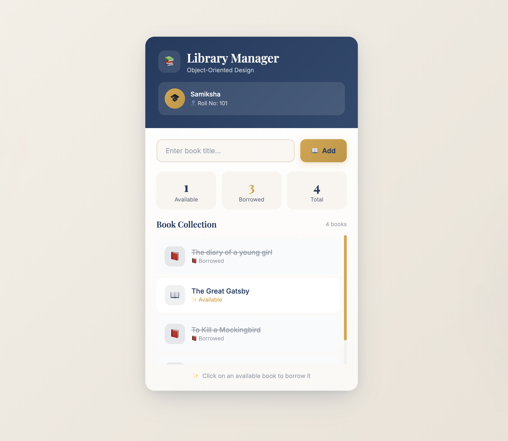

# 📚 Library Management System (JavaScript OOP Project)

A modern, interactive **Library Management System** built using **core Object-Oriented Programming (OOP) concepts in JavaScript** with a clean UI and smooth user experience.

---

## 🚀 Project Overview

This mini project simulates a basic library system where users can:
- Add new books to the library  
- Borrow books with a single click  
- See real-time UI updates  
- Experience a visually appealing, animated interface  

The project focuses on applying **OOP concepts to real project structure**, not just theory.

---

## 🧠 Concepts Used

This project is built using pure JavaScript with strong emphasis on:

- ✅ Constructors & `new` keyword  
- ✅ Classes in JavaScript  
- ✅ Inheritance  
- ✅ Object-Oriented Design  
- ✅ DOM Manipulation  
- ✅ Event Handling  
- ✅ UI Styling with CSS  
- ✅ Interactive User Experience  

---

## ✨ Features

- 📖 Add books dynamically  
- 👩‍🎓 Student member borrowing system  
- 🔁 Real-time UI updates on interaction  
- 🎨 Modern card-based UI with gradients and hover effects  
- 🧩 Clean, modular and readable code  
- 📱 Responsive design (works on desktop & mobile)

---

## 🛠️ Tech Stack

- HTML5  
- CSS3  
- JavaScript (ES6+)  
- Object-Oriented Programming (OOP)

---

## 📂 Project Structure
```
Library-Management-System/
│
├── index.html   # UI + styling + script
└── README.md    # Project documentation
```

---
## 📸 Preview

```markdown

